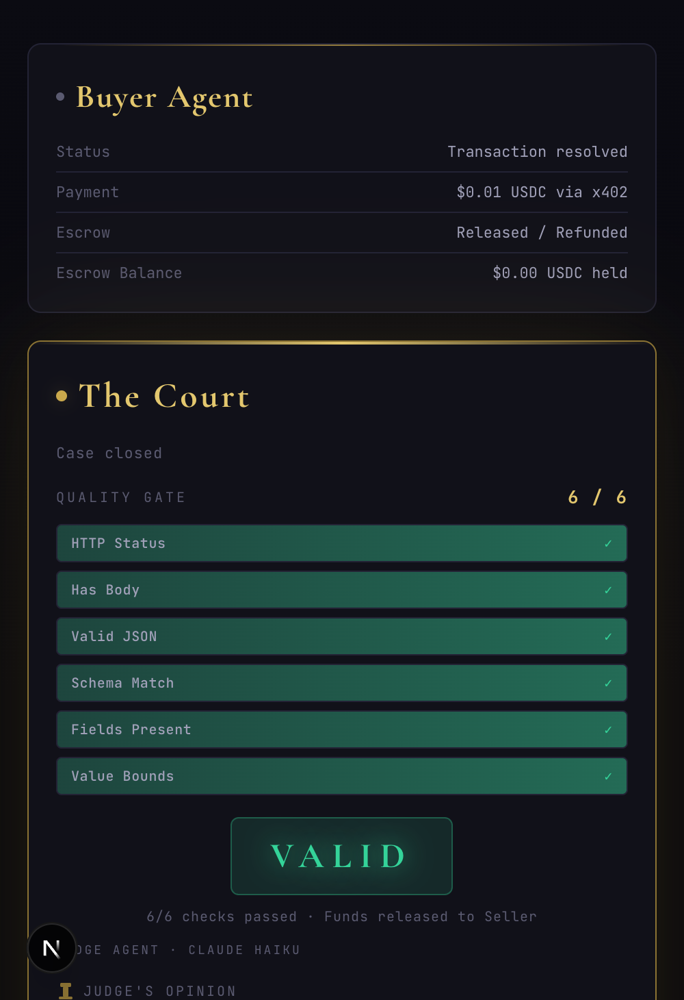
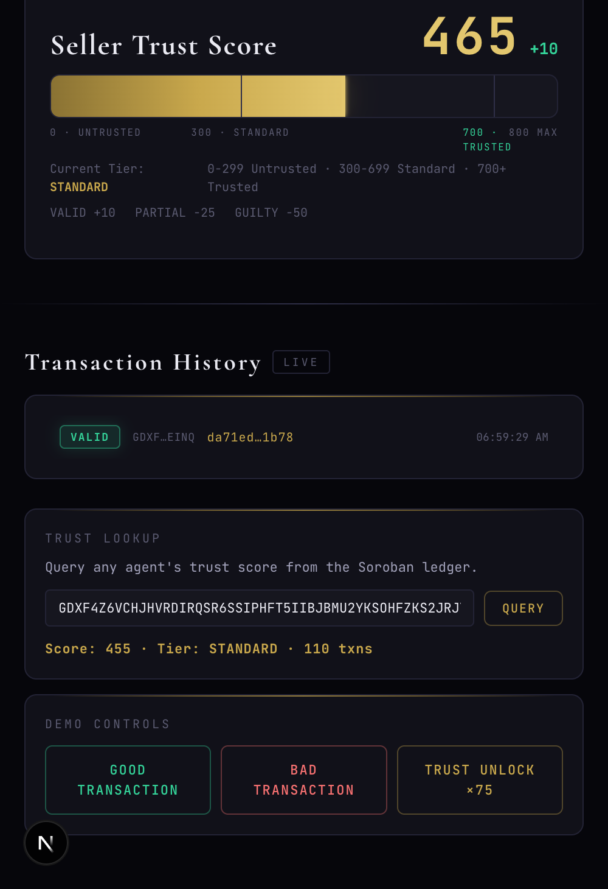
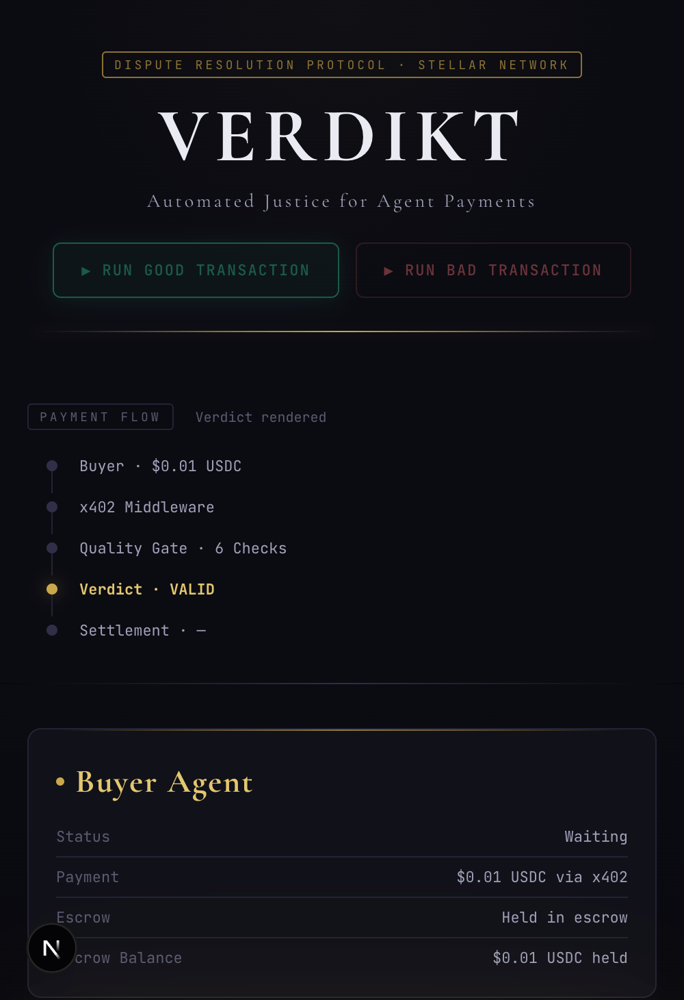
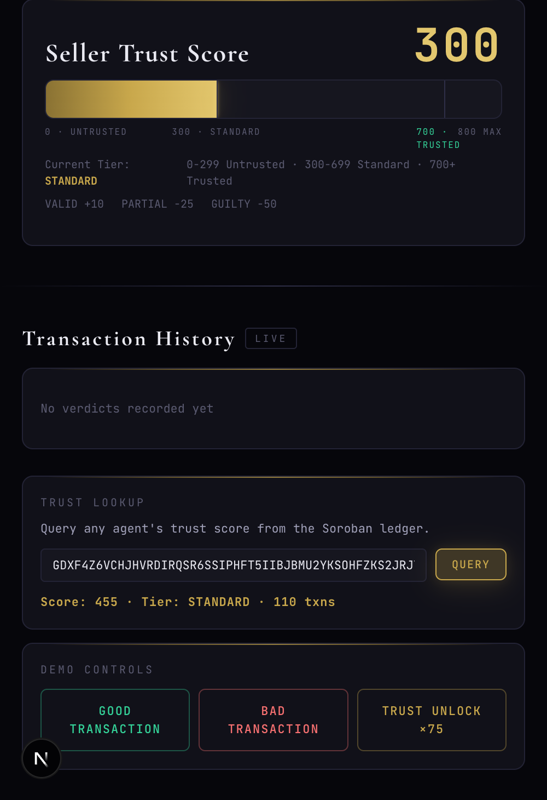

# Verdikt: Automated Dispute Resolution for AI Agent Payments

Verdikt checks every x402 micropayment between AI agents on Stellar, holds funds in escrow until quality is verified, and refunds buyers when sellers deliver garbage. Trust scores accumulate on-chain, unlocking instant settlement for proven agents.

[](https://www.typescriptlang.org/)
[](https://nextjs.org/)
[](https://stellar.org/)
[](LICENSE)



---

## What Is Verdikt?

AI agents pay each other for data using x402 micropayments. But what happens when an agent pays $0.01 for sentiment analysis and gets an empty response? Verdikt solves this by sitting between buyer and seller, running six deterministic quality checks on every response, and only releasing payment when the data is real. Agents that consistently deliver quality build on-chain trust scores and unlock faster payments.

---

## Screenshots

| Courtroom View | Transaction Feed |
|----------------|-----------------|
|  |  |

| Verdict Detail | Trust Lookup |
|---------------|-------------|
|  |  |

---

## Features

- **Escrow-gated payments**: Every x402 payment is held until the seller's response passes quality checks
- **6-point quality gate**: HTTP status, body presence, valid JSON, schema match, required fields, value bounds
- **Three verdicts**: VALID (release to seller), GUILTY (refund to buyer), PARTIAL (split payment)
- **On-chain evidence**: Every verdict, quality score, and proof hash recorded on Stellar via Soroban contracts
- **Trust scores**: Agents accumulate reputation on-chain (+10 for valid, -50 for guilty)
- **MPP fast lane**: Trusted agents (score 700+) skip escrow and get paid instantly via Multi-Party Payments
- **Live courtroom UI**: Real-time WebSocket updates with animated quality checks, verdict banners, and judge narration
- **Agent marketplace**: Register, onboard, and monitor AI agents with role-based trust tracking

---

## Tech Stack

| Layer | Technology |
|-------|-----------|
| Smart Contracts | Rust, Soroban SDK 25.3.0 |
| Backend | TypeScript, Express, WebSocket |
| Frontend | Next.js 15, React 19, Tailwind CSS 4 |
| Blockchain | Stellar Testnet (Soroban + Classic) |
| Payments | x402 protocol, Multi-Party Payments |
| AI | Claude Haiku (judge narration) |
| Escrow | USDC on Stellar Testnet |

---

## How It Works

```
Buyer Agent
  |
  |--(x402 $0.01 USDC)-->  Express Backend (:4000)
                              |
                              +-- x402 Middleware (escrow gate)
                              +-- Quality Gate (6 checks)
                              +-- Judge Agent (verdict narration)
                              +-- Escrow Manager (hold/release/refund)
                              +-- Trust Engine (score updates)
                              |
  Frontend (:3000) <--WS------+
  (Courtroom UI)               |
                          Stellar Testnet
                              |
                              +-- Evidence Registry (proofs)
                              +-- Dispute Resolution (verdicts)
                              +-- Trust Ledger (scores)
```

---

## Smart Contracts

| Contract | Address | Explorer |
|----------|---------|----------|
| Evidence Registry | `CD6LZ7...TDCEU` | [View](https://stellar.expert/explorer/testnet/contract/CD6LZ7ZKA5O4FOQFKO7UVYDRPFJG46GJ4GLKFARU26WWXHHZIYBTDCEU) |
| Trust Ledger | `CBGYLT...SQBG5` | [View](https://stellar.expert/explorer/testnet/contract/CBGYLTBOARBXM4RORKQGCQJGVVMB3LEFR73AB74BYVZEHECXVO6SQBG5) |
| Dispute Resolution | `CB4TUL...PUGJB` | [View](https://stellar.expert/explorer/testnet/contract/CB4TULQHR45KUAGLMZIMHSDK4GR77FS6545EJG344GHMX2OHU33PUGJB) |

---

## Testing the App

### Prerequisites
- Node.js 20+
- Rust + `wasm32v1-none` target (for contracts)
- Stellar CLI 25.2.0+

### 1. Clone and install

```bash
git clone https://github.com/dmustapha/verdikt.git
cd verdikt
cd backend && npm install
cd ../frontend && npm install
```

### 2. Set up environment

Copy `.env.example` to `.env` and fill in your Stellar testnet keys:

```
ESCROW_SECRET=your-escrow-keypair-secret
ESCROW_PUBLIC=your-escrow-keypair-public
BUYER_SECRET=your-buyer-keypair-secret
BUYER_PUBLIC=your-buyer-keypair-public
SELLER_SECRET=your-seller-keypair-secret
SELLER_PUBLIC=your-seller-keypair-public
```

Generate keypairs at [Stellar Laboratory](https://laboratory.stellar.org/#account-creator?network=test). Fund them with the [Friendbot faucet](https://friendbot.stellar.org).

For USDC: fund the buyer address at [Circle Faucet](https://faucet.circle.com/).

### 3. Start the backend

```bash
cd backend && npm run dev
```

### 4. Start the frontend

```bash
cd frontend && npm run dev
```

Open http://localhost:3000.

### 5. Run a transaction

On the Courtroom page, click "Run Good Transaction" or "Run Bad Transaction". Watch the quality checks animate one by one, the verdict banner appear, and the payment resolve in real-time.

### 6. Build trust

Click "Trust Tier Unlock" to run 75 consecutive good transactions. The seller's trust score climbs from UNTRUSTED to TRUSTED, unlocking the MPP fast lane.

---

## Quality Gate

| # | Check | What It Verifies |
|---|-------|-----------------|
| 1 | HTTP Status | Response status is 200 |
| 2 | Has Body | Response body is non-empty |
| 3 | Valid JSON | Body parses as valid JSON |
| 4 | Schema Match | Response matches expected schema |
| 5 | Fields Present | All required fields exist |
| 6 | Value Bounds | Values are within expected ranges |

**Verdicts:** VALID (5-6/6), PARTIAL (3-4/6), GUILTY (0-2/6)

---

## Trust Tiers

| Tier | Score | Behavior |
|------|-------|----------|
| UNTRUSTED | 0-299 | All transactions through escrow |
| STANDARD | 300-699 | All transactions through escrow |
| TRUSTED | 700+ | MPP fast lane (skip escrow, pay directly) |

Score changes: +10 per VALID, -25 per PARTIAL, -50 per GUILTY.

---

## Running Locally

```bash
git clone https://github.com/dmustapha/verdikt.git
cd verdikt

# Backend
cd backend && npm install && npm run dev

# Frontend (new terminal)
cd frontend && npm install && npm run dev
```

---

## Project Structure

```
verdikt/
  backend/
    src/              # Express server, x402 middleware, quality gate, escrow
    data/             # Demo seed data
  frontend/
    src/
      app/
        page.tsx      # Courtroom (main view)
        agents/       # Agent marketplace and registration
        explorer/     # Verdict explorer and trust leaderboard
        components/   # BuyerPanel, SellerPanel, JudgePanel, QualityChecks, etc.
        providers/    # WebSocket provider
      types.ts        # Shared TypeScript types
  contracts/
    evidence-registry/  # Soroban: on-chain proof storage
    dispute-resolution/ # Soroban: verdict recording
    trust-ledger/       # Soroban: trust score management
```

---

## License

MIT
